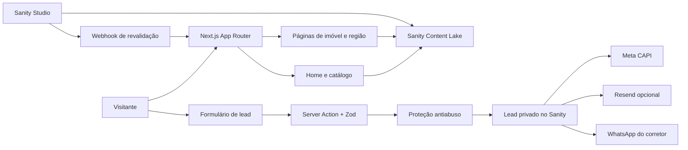

<div align="center">

# Cláudio Corretor

### Plataforma imobiliária orientada a conversão para o Rio de Janeiro

[](https://claudioimoveis2.vercel.app)
[](https://nextjs.org/)
[](https://www.sanity.io/)
[](https://github.com/ognin3/claudioimoveis/actions/workflows/ci.yml)

Catálogo de imóveis, páginas regionais e funil de captação construídos para transformar
tráfego pago do Meta em conversas qualificadas no WhatsApp.

[Ver site](https://claudioimoveis2.vercel.app) · [Arquitetura](./docs/ARQUITETURA.md) · [Plano do projeto](./docs/PLANO-DE-ACAO.md)

</div>

---

## O produto

O projeto reúne os empreendimentos atendidos pelo Cláudio em uma experiência rápida,
responsiva e fácil de manter. A pessoa encontra o imóvel por região, conhece fotos,
plantas, diferenciais e localização, deixa seus dados com consentimento e segue para um
atendimento direto no WhatsApp.

- Home comercial com lançamentos recentes e prova de confiança.
- Catálogo com filtros locais, sem recarregar a página.
- Landing pages por imóvel e por região para anúncios e SEO.
- Galeria, plantas ampliadas e mapa integrado.
- Formulário curto com UTMs, `fbclid` e consentimento LGPD.
- Meta Pixel + Conversions API com deduplicação por `eventID`.
- Studio Sanity em `/studio` para atualizar o conteúdo sem editar código.
- Tema escuro premium, animações progressivas e suporte a `prefers-reduced-motion`.
- Imagens responsivas em AVIF/WebP pelo CDN do Sanity.

## Como tudo se conecta



O conteúdo público usa cache e CDN. Dados pessoais percorrem somente código de servidor e
são gravados como drafts privados, mesmo com o dataset de conteúdo público.

## Stack

| Camada      | Tecnologia                    | Responsabilidade                                    |
| ----------- | ----------------------------- | --------------------------------------------------- |
| Aplicação   | Next.js 16.3.2 + React 19.2.8 | App Router, PPR, Server Components e Server Actions |
| Linguagem   | TypeScript strict             | Tipagem do site, integrações e scripts              |
| Interface   | Tailwind CSS 4 + CSS nativo   | Design responsivo e animações leves                 |
| Conteúdo    | Sanity 6 + next-sanity        | Imóveis, regiões, construtoras, imagens e leads     |
| Validação   | Zod                           | Normalização e validação do formulário              |
| Conversão   | Meta Pixel + CAPI             | Medição e atribuição de leads                       |
| Notificação | Resend                        | Aviso opcional por e-mail                           |
| Hospedagem  | Vercel                        | Build, CDN, funções e deploy contínuo               |

## Mapa do código

```text
src/
├─ app/
│  ├─ (site)/                 páginas públicas e Server Action de lead
│  ├─ api/revalidate/         webhook assinado do Sanity
│  ├─ studio/                 painel editorial incorporado
│  └─ sitemap, robots e OG    descoberta, SEO e compartilhamento
├─ components/
│  ├─ catalogo/               filtros e listagem de imóveis
│  ├─ conversao/              formulários, Pixel e CTAs
│  ├─ imovel/                 cards, galeria, plantas e mapa
│  ├─ layout/                 cabeçalho, rodapé e WhatsApp flutuante
│  └─ ui/                     primitivos visuais reutilizáveis
├─ lib/
│  ├─ sanity/                 clientes, queries, cache e imagens
│  ├─ meta/                   eventos do Pixel e Conversions API
│  ├─ site.ts                 dados oficiais do corretor
│  └─ whatsapp.ts             mensagens e links padronizados
└─ types/                     contratos TypeScript do domínio

sanity/
├─ schemas/                   modelos de imóveis, regiões, leads e configurações
└─ structure.ts               navegação editorial do Studio

scripts/                      normalização, imagens e importação do acervo
docs/                         decisões, auditorias e operação do projeto
```

A explicação detalhada de renderização, cache, conteúdo, segurança e fluxo de lead está em
[docs/ARQUITETURA.md](./docs/ARQUITETURA.md).

## Segurança e privacidade

- Nenhum segredo usa prefixo `NEXT_PUBLIC_`.
- Leads são criados como `drafts.lead.*` e não podem ser publicados pelo Studio.
- Nome, telefone e e-mail não aparecem em queries públicas.
- O imóvel enviado pelo navegador é conferido novamente no Sanity.
- URLs de origem externas são descartadas.
- Rate limit distribuído usa HMAC do IP; o endereço bruto não é armazenado.
- Honeypot e tempo de preenchimento reduzem automação simples.
- CSP, HSTS, `nosniff`, proteção contra iframe e Permissions Policy estão ativos.
- Meta e Resend têm timeout e falhas não apagam o lead já salvo.
- Dependências passam por auditoria automática no CI.

Consulte [SECURITY.md](./SECURITY.md) para reportar uma vulnerabilidade com segurança.

## Executar localmente

Requisitos: Node.js 24 e acesso ao projeto Sanity.

```bash
npm ci
copy .env.example .env.local
npm run dev
```

- Site: `http://localhost:3000`
- Studio: `http://localhost:3000/studio`

### Variáveis de ambiente

| Variável                        | Onde     | Finalidade                      |
| ------------------------------- | -------- | ------------------------------- |
| `NEXT_PUBLIC_SITE_URL`          | público  | URL canônica do site            |
| `NEXT_PUBLIC_SANITY_PROJECT_ID` | público  | Projeto de conteúdo             |
| `NEXT_PUBLIC_SANITY_DATASET`    | público  | Dataset consultado              |
| `SANITY_API_WRITE_TOKEN`        | servidor | Grava leads e importa conteúdo  |
| `SANITY_REVALIDATE_SECRET`      | servidor | Assina o webhook de atualização |
| `LEAD_SECURITY_SECRET`          | servidor | HMAC do limitador antiabuso     |
| `NEXT_PUBLIC_META_PIXEL_ID`     | público  | Identificador do Pixel          |
| `META_CAPI_ACCESS_TOKEN`        | servidor | Envio pela Conversions API      |
| `RESEND_API_KEY`                | servidor | Notificação opcional por e-mail |

A lista completa e comentada está em [.env.example](./.env.example). Nunca versione
`.env.local`.

## Comandos importantes

```bash
npm run dev          # ambiente local
npm run typecheck    # contratos TypeScript
npm run lint         # qualidade estática
npm run build        # build de produção
npm run format:check # padronização dos arquivos
npm run seed         # carga inicial do Sanity
```

Antes de publicar, o pipeline exige instalação reproduzível, auditoria de dependências,
TypeScript, ESLint e build completo.

## Conteúdo no Sanity

| Documento       | Uso                                                     |
| --------------- | ------------------------------------------------------- |
| `imovel`        | ficha, tipologias, imagens, plantas, diferenciais e SEO |
| `regiao`        | páginas locais, zona e descrição editorial              |
| `construtora`   | marca e filtro do catálogo                              |
| `depoimento`    | prova social aprovada                                   |
| `configuracoes` | hero, apresentação e foto do corretor                   |
| `lead`          | contato privado, origem da campanha e etapa comercial   |

Publicar ou editar conteúdo dispara `/api/revalidate`, que invalida apenas as tags
necessárias. Não é preciso reconstruir todo o site.

## Publicação

O branch `master` é a fonte da produção. O GitHub executa a verificação de qualidade e a
integração da Vercel gera o deploy. No ambiente final:

1. Configure todas as variáveis em Production e Preview.
2. Use o domínio definitivo em `NEXT_PUBLIC_SITE_URL`.
3. Cadastre `https://SEU-DOMINIO/api/revalidate` como webhook no Sanity.
4. Valide Pixel e CAPI em Eventos de Teste antes de investir em mídia.
5. Confira formulário, WhatsApp, sitemap, robots e logs após a promoção.

## Documentação do projeto

- [Arquitetura técnica](./docs/ARQUITETURA.md)
- [Plano de ação](./docs/PLANO-DE-ACAO.md)
- [Estratégia de Meta Ads](./docs/META-ADS.md)
- [Checklist de SEO e lançamento](./docs/SEO-LANCAMENTO.md)
- [Auditoria dos dados](./docs/AUDITORIA-DADOS.md)
- [Decisões permanentes](./CLAUDE.md)

---

<div align="center">

Desenvolvido para **Cláudio Corretor · CRECI 103666**.

Código e conteúdo de uso comercial. Nenhuma licença de redistribuição é concedida.

</div>
